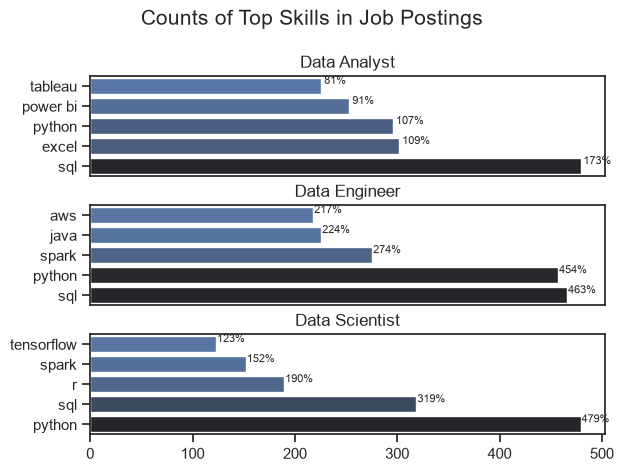

# Python Data Project

This repository contains my Python data analysis learning project, focused on practical data exploration, transformation, and visualization using pandas, matplotlib, and seaborn.

## Project structure

- `1_Basics/` — foundational Python and data handling exercises
- `2_Advanced/` — advanced pandas, data cleaning, charts, and analysis notebooks
- `3_Projects/` — mini project and exploratory data analysis work
- `README.md` — project overview and usage notes

## The Analysis

1. What are the most demanded skills for top 3 most popular data roles?

To find the most demanded skills for the top 3 most popular data roles. I filtered out those positions by which ones were the most popular, and got the top 5 skills for these top 3 roles. This query highlights the most popular job titles and their top skills, showing which skills i should pay attention to depending on the role i'm targeting. 

View my notebook with detailed steps here : 

[2_skills_demand_in_Vietnam](3_Projects\2_skills_demand_in_Vietnam.ipynb)

**1.1. Visualization data:**


```python
fig,ax =plt.subplots(len(job_titles),1)

sns.set_theme(style ='ticks')  # Set the theme of the plot

for i, job_title in enumerate(job_titles):
    df_plot = df_skills_perc[df_skills_perc['job_title_short'] == job_title].head(5)
    #df_plot.plot(kind = 'barh', x ='job_skills',y='skills_percent',ax=ax[i],title=job_title)
    sns.barplot(data=df_plot, x='skills_percent', y='job_skills', ax=ax[i],hue = 'skill_count',palette='dark:b_r')
    ax[i].set_title(job_title)
    ax[i].invert_yaxis()
    ax[i].set_ylabel('')
    ax[i].set_xlabel('')
    ax[i].legend().set_visible(False)
    ax[1].set_xlim(0,500)

    for n ,v in enumerate(df_plot['skills_percent']):
        ax[i].text(v + 1,n+.25, f'{v:.0f}%', fontsize =8, va='center')

    if i != len(job_titles)-1:
        ax[i].set_xticks([])
      
fig.suptitle('Counts of Top Skills in Job Postings',fontsize =15)
fig.tight_layout(h_pad = 0.5)
plt.show()
```

**1.2.Results**

[Visualization for Top skills](3_Projects\images\skills_demand_all_data_roles.png)



**1.3. Insights**

- SQL and Python are prominent across all three roles in Vietnam. SQL leads the Data Analyst and Data Engineer charts, while Python leads the Data Scientist chart. This suggests that querying and programming skills are recurring requirements across data job categories.
- Each role has a different technical emphasis. Data Analysts show SQL, Excel, Python and Power BI/Tableau; Data Engineers emphasize SQL, Python, Spark and Java; Data Scientists emphasize Python, SQL, R, Spark and TensorFlow.
- Interesting insight: the roles overlap, but their specialized tools differ. SQL and Python appear in all three top-five lists, while Excel and BI tools appear in the Data Analyst list, and Spark appears for both Data Engineers and Data Scientists. This points to a distinction between reporting-oriented, data-infrastructure and modeling-oriented skill sets.

## Environment

This project was developed in a Python environment and includes notebook-based learning exercises.

## Notes

The large local data files used for analysis are intentionally excluded from GitHub upload to respect repository size limits. The notebooks and project code remain available here for learning and review.
