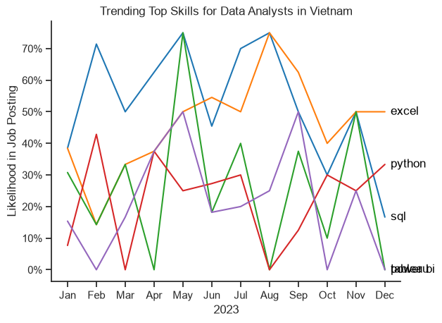
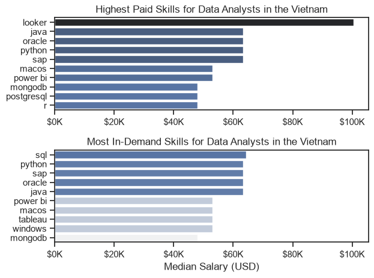
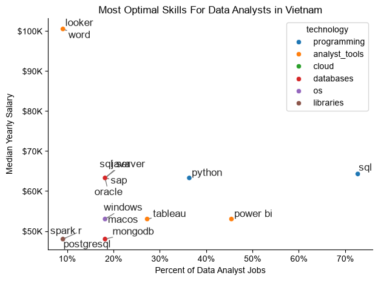

# Python Data Project

This repository contains my Python data analysis learning project, focused on practical data exploration, transformation, and visualization using pandas, matplotlib, and seaborn.

## Project structure

- `1_Basics/` — foundational Python and data handling exercises
- `2_Advanced/` — advanced pandas, data cleaning, charts, and analysis notebooks
- `3_Projects/` — mini project and exploratory data analysis work
- `README.md` — project overview and usage notes

## The Analysis

1. What are the most demanded skills for top 3 most popular data roles?

To find the most demanded skills for the top 3 most popular data roles. I filtered out those positions by which ones were the most popular, and got the top 5 skills for these top 3 roles. This query highlights the most popular job titles and their top skills, showing which skills i should pay attention to depending on the role i'm targeting.

View my notebook with detailed steps here :

[2_skills_demand_in_Vietnam](3_Projects\2_skills_demand_in_Vietnam.ipynb)

**1.1. Visualization data:**

```python
fig,ax =plt.subplots(len(job_titles),1)

sns.set_theme(style ='ticks')  # Set the theme of the plot

for i, job_title in enumerate(job_titles):
    df_plot = df_skills_perc[df_skills_perc['job_title_short'] == job_title].head(5)
    #df_plot.plot(kind = 'barh', x ='job_skills',y='skills_percent',ax=ax[i],title=job_title)
    sns.barplot(data=df_plot, x='skills_percent', y='job_skills', ax=ax[i],hue = 'skill_count',palette='dark:b_r')
    ax[i].set_title(job_title)
    ax[i].invert_yaxis()
    ax[i].set_ylabel('')
    ax[i].set_xlabel('')
    ax[i].legend().set_visible(False)
    ax[1].set_xlim(0,500)

    for n ,v in enumerate(df_plot['skills_percent']):
        ax[i].text(v + 1,n+.25, f'{v:.0f}%', fontsize =8, va='center')

    if i != len(job_titles)-1:
        ax[i].set_xticks([])
  
fig.suptitle('Counts of Top Skills in Job Postings',fontsize =15)
fig.tight_layout(h_pad = 0.5)
plt.show()
```

**1.2.Results**

[Visualization for Top skills](3_Projects\images\skills_demand_all_data_roles.png)


**1.3. Insights**

- SQL and Python are prominent across all three roles in Vietnam. SQL leads the Data Analyst and Data Engineer charts, while Python leads the Data Scientist chart. This suggests that querying and programming skills are recurring requirements across data job categories.
- Each role has a different technical emphasis. Data Analysts show SQL, Excel, Python and Power BI/Tableau; Data Engineers emphasize SQL, Python, Spark and Java; Data Scientists emphasize Python, SQL, R, Spark and TensorFlow.
- Interesting insight: the roles overlap, but their specialized tools differ. SQL and Python appear in all three top-five lists, while Excel and BI tools appear in the Data Analyst list, and Spark appears for both Data Engineers and Data Scientists. This points to a distinction between reporting-oriented, data-infrastructure and modeling-oriented skill sets.What are the most demanded skills for top 3 most popular data roles?

2. **How are in-demand skills trending for Data Analyst in Vietnam?**

[Trending Top skills for Data Analyst in Vietnam](3_Projects\images\trending_skills_in_Vietnam_for_da.png)



**2.1. Visualization data**

```python
from matplotlib.ticker import PercentFormatter

df_plot = df_DA_VN_percent.iloc[:, :5]
sns.set_theme(style='ticks')

sns.lineplot(
    data=df_plot,
    dashes=False,
    legend='full',
    palette='tab10'
)
sns.despine() # remove top and right spines

plt.title('Trending Top Skills for Data Analysts in Vietnam')
plt.ylabel('Likelihood in Job Posting')
plt.xlabel('2023')
plt.legend().remove()
plt.gca().yaxis.set_major_formatter(PercentFormatter(decimals=0))

for i in range(5):
    y = df_plot.iloc[-1, i]

    # Check previous labels and move this one if too close
    for j in range(i):
        previous_y = df_plot.iloc[-1, j]

        if abs(y - previous_y) < 0.05:
            y += 0.05

    plt.text(
        11.2,
        y,
        df_plot.columns[i],
        color='black',
        va='center'
    )

plt.show()
```

**2.2. Insights**

* **SQL and Excel show relatively strong demand throughout the year.** SQL peaks around May–August, while Excel reaches its highest level in August and remains relatively high toward the end of the year.
* **Python shows more volatility but remains an important skill.** Its demand fluctuates significantly, reaching around 40%+ in February and ending the year at roughly 33%, suggesting Python was consistently relevant but less stable month-to-month.
* **BI tools such as Power BI and Tableau appear less consistently demanded.** Both fluctuate substantially and fall close to 0% in several months, suggesting that although BI tools are relevant for Data Analyst roles, they were not consistently mentioned across the job postings in this dataset.

3. **How well do jobs and skills pay for Data Analyst in Vietnam**

[Highest Paid Skills for Data Analysts in the Vietnam](3_Projects\images\highest_paid_skills_in_Vietnam.png)



**3.1. Visualization data**

```python
fig, ax = plt.subplots(2, 1)  

# Top 10 Highest Paid Skills for Data Analysts
sns.barplot(data=df_DA_top_pay, x='median', y=df_DA_top_pay.index, hue='median', ax=ax[0], palette='dark:b_r')
ax[0].legend().remove()
# original code:
# df_DA_top_pay[::-1].plot(kind='barh', y='median', ax=ax[0], legend=False) 
ax[0].set_title('Highest Paid Skills for Data Analysts in the Vietnam')
ax[0].set_ylabel('')
ax[0].set_xlabel('')
ax[0].xaxis.set_major_formatter(plt.FuncFormatter(lambda x, _: f'${int(x/1000)}K'))


# Top 10 Most In-Demand Skills for Data Analysts')
sns.barplot(data=df_DA_skills, x='median', y=df_DA_skills.index, hue='median', ax=ax[1], palette='light:b')
ax[1].legend().remove()
# original code:
# df_DA_skills[::-1].plot(kind='barh', y='median', ax=ax[1], legend=False)
ax[1].set_title('Most In-Demand Skills for Data Analysts in the Vietnam')
ax[1].set_ylabel('')
ax[1].set_xlabel('Median Salary (USD)')
ax[1].set_xlim(ax[0].get_xlim())  # Set the same x-axis limits as the first plot
ax[1].xaxis.set_major_formatter(plt.FuncFormatter(lambda x, _: f'${int(x/1000)}K'))

sns.set_theme(style='ticks')
plt.tight_layout()
plt.show()
```

**3.2. Insights**

* **Higher pay does not always mean higher demand.** Looker has the highest median salary at around  **$100K** , but it does not appear among the most in-demand skills. Meanwhile, SQL and Python are highly demanded but have lower median salaries.
* **SQL, Python, SAP, Oracle, and Java offer a strong combination of demand and salary.** These skills appear in the top 5 most in-demand skills while also having median salaries around  **$60K+** , making them relatively attractive skills for Data Analysts.
* **Specialized tools can command a salary premium.** Skills such as **Looker, Java, Oracle, and SAP** are associated with relatively high median salaries, suggesting that specialization in certain technologies may provide higher earning potential than more common analyst tools such as Power BI or Tableau.

4. **What is the most optimal skill to learn for Data Analysts?**

**4.1. Visualization Data**


```python
from adjustText import adjust_text
#df_DA_skills_high_demand.plot(kind='scatter', x='skill_percent', y='median_salary')

sns.scatterplot(
    data = df_plot,
    x = 'skill_percent',
    y = 'median_salary',
    hue = 'technology'
)

#make colour
sns.despine()
sns.set_theme(style='ticks')


# Prepare texts for adjustText
texts = []
for i, txt in enumerate (df_DA_skills_high_demand.index):
    texts.append(plt.text(df_DA_skills_high_demand['skill_percent'].iloc[i],df_DA_skills_high_demand['median_salary'].iloc[i], txt))

# Adjust text to avoid overlap
adjust_text(texts, arrowprops=dict(arrowstyle='->', color='gray'))

# Set axis labels, title, and legend
plt.xlabel('Percent of Data Analyst Jobs')
plt.ylabel('Median Yearly Salary')
plt.title('Most Optimal Skills For Data Analysts in Vietnam')

from matplotlib.ticker import PercentFormatter  

ax = plt.gca()
ax.yaxis.set_major_formatter(plt.FuncFormatter(lambda y, pos : f'${int(y/1000)}K')) # format lại trục y theo cấu trúc $..K
ax.xaxis.set_major_formatter(PercentFormatter(decimals=0))

# Adjust layout and display plot 
plt.tight_layout()
plt.show()
```

[Optimal skills for DA in Vietnam](3_Projects\images\most_optimal_skills_for_data_analyst_in_Vietnam.png)



**4.2. Insights**

* **SQL stands out as the strongest “optimal” skill.** It appears in roughly **70%+ of Data Analyst jobs** while still offering a median salary of around  **$65K** , giving it the best balance between demand and earning potential in this chart.
* **Looker and Word are high-paying but niche skills.** Both are associated with salaries around  **$100K** , but they appear in only about  **10% of jobs** , suggesting a potential salary premium for specialized skills with lower market demand.
* **Python and BI tools offer a more balanced path.** Python appears in roughly **37% of jobs** with a median salary around  **$63K** , while Power BI and Tableau have moderate demand and salaries around  **$53–54K** . This suggests Python may be particularly valuable for combining  **relatively broad demand with strong earning potential** .

## Environment

This project was developed in a Python environment and includes notebook-based learning exercises.

## Notes

The large local data files used for analysis are intentionally excluded from GitHub upload to respect repository size limits. The notebooks and project code remain available here for learning and review.
